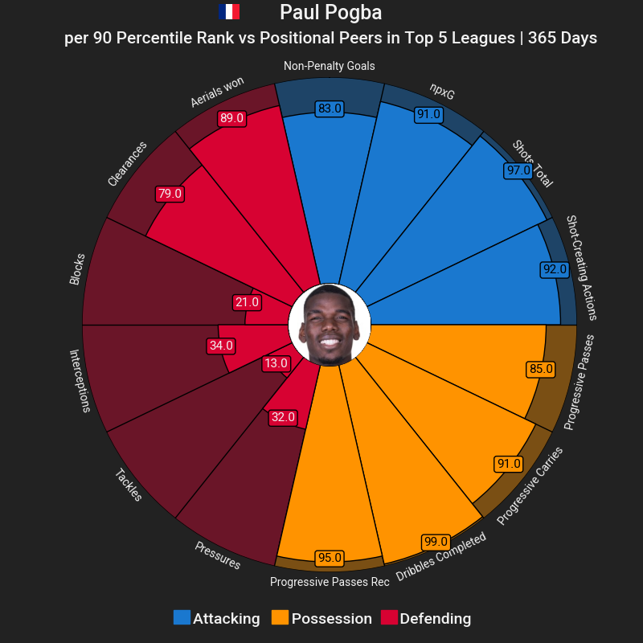
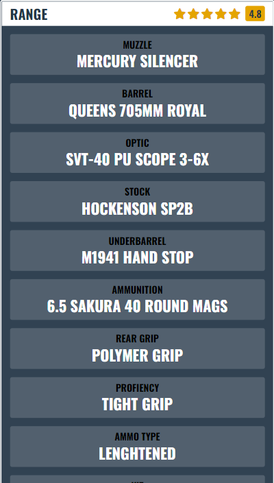

# So Funny Discord bot

A Discord bot without any moderation functions, just some fun stuff!

One of the functions is based on the [mplsoccer](https://github.com/andrewRowlinson/mplsoccer) library which will take a player name input, parse fbref.com for statistics and then outputs a pie chart.

Example output:

Another function is getting the meta loadout of a weapon in Call of Duty: Warzone

Example output:

